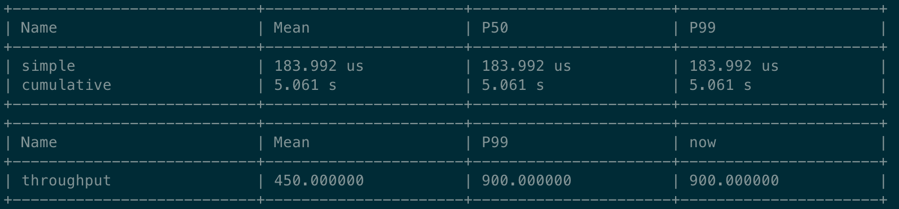

# PerfTimer

A simple header-only performance timer for CPP (c++). A dedicated thread will print the data of all timers periodically.



# Usage

## Case 1: the simple case

```cpp
// Case 1: the simple case
perf_timer::Timer timer_simple("simple");
// do something that we concern
usleep(100);
timer_simple.end();
```

## Case 2: the cumulative case

```cpp
// Case 2: the cumulative case
perf_timer::Timer timer_cumulative("cumulative");
for (int i = 0; i < 1000; i++) {
	// do something
	usleep(10);
	{
		// something that we concern
		timer_cumulative.CumStart();
		usleep(i * 10);
		timer_cumulative.CumEnd();
	}
	// do something
	usleep(10);
}
timer_cumulative.CumReport();
```

## Case 3: perf counter

```cpp
// Case 3: record a perf counter
for (int i = 0; i < 10; i++) {
	perf_timer::PerfCounter::Record("throughput", i * 100);
}
```
